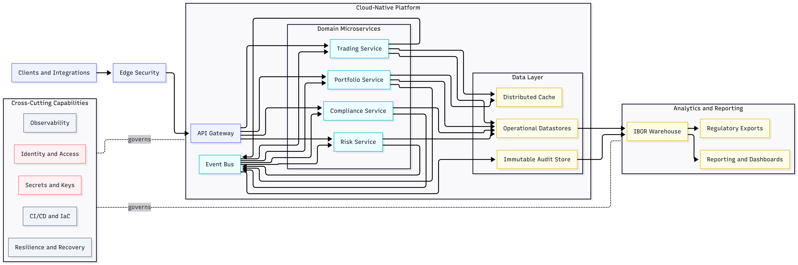

# FinTech Architectural Excellence Checklist (.NET/Azure)

**FAEF Implementation Checklist for Portfolio Management Platforms**


Version: 1.0 | Target: .NET/Azure | Compliance: GDPR, PSD2, DORA, EU AI Act

---

##  1. Architecture Foundation

**Microservices & Event-Driven**
- [ ] ASP.NET Core Web API services (independently deployable)
- [ ] Domain-Driven Design (DDD) - bounded contexts aligned with business domains
- [ ] Azure Kubernetes Service (AKS) with Istio service mesh
- [ ] Azure Service Bus for async messaging (event-driven patterns)
- [ ] Azure Event Grid for event routing
- [ ] CQRS pattern (Command Query Responsibility Segregation)
- [ ] API Gateway (Azure API Management)
- [ ] Dapr for microservices runtime (state management, pub/sub, service-to-service calls)



**Key Pattern:** Each financial domain (Portfolio, Trading, Compliance, Risk) = separate microservice

---

## 2. Regulatory Compliance Architecture

**Audit & Traceability (GDPR, PSD2, DORA)**
- [ ] Immutable audit logs (Azure Event Hubs → Data Lake Storage)
- [ ] Complete transaction traceability (distributed tracing with Application Insights)
- [ ] GDPR data retention policies (Azure Purview data governance)
- [ ] Automated regulatory reporting (Azure Functions + Synapse Analytics)
- [ ] PSD2 Strong Customer Authentication (SCA) - multi-factor auth
- [ ] DORA operational resilience testing (chaos engineering with Azure Chaos Studio)
- [ ] MiFID II algorithmic trading audit logs
- [ ] Data residency controls (Azure Policy for EU regions)

**Key Pattern:** Compliance-by-design - regulations embedded in architecture, not bolted on

---

## 3. Security Architecture

**Zero-Trust Implementation**
- [ ] Azure AD B2C for identity & access management (IAM)
- [ ] OAuth 2.0 + OpenID Connect for authentication
- [ ] JWT tokens with short expiration (15 min access, refresh tokens)
- [ ] Azure Key Vault for secrets management (connection strings, API keys, certificates)
- [ ] Managed Identities (no hardcoded credentials)
- [ ] Encryption at rest (Azure Storage Service Encryption, Transparent Data Encryption for SQL)
- [ ] Encryption in transit (TLS 1.3 minimum)
- [ ] Azure Security Center + Microsoft Defender for Cloud
- [ ] Azure Sentinel (SIEM) for threat detection
- [ ] Network security groups (NSGs) + Azure Firewall
- [ ] Private endpoints for PaaS services (no public internet exposure)

**Key Pattern:** Assume breach - verify explicitly, use least privilege, segment access

---

## 4. Data Governance

**Investment Book of Record (IBOR)**
- [ ] Azure Synapse Analytics as data warehouse (single source of truth)
- [ ] Azure Data Factory for ETL pipelines
- [ ] Azure Cosmos DB for multi-region replication (global distribution)
- [ ] Data quality validation at ingestion (Data Factory data flows)
- [ ] Master data management (reference data for securities, clients, accounts)
- [ ] Data lineage tracking (Azure Purview)
- [ ] GDPR data subject rights (automated export, deletion, portability)
- [ ] Data classification (PII, sensitive, public)
- [ ] Data sovereignty (EU data stays in EU regions)

**Key Pattern:** One authoritative source for positions, transactions, client data

---

## 5. Performance & Scalability

**Sub-Second Response Times**
- [ ] Azure Cache for Redis (distributed caching)
- [ ] Azure Front Door (global load balancing + CDN)
- [ ] Horizontal pod autoscaling (HPA) in AKS
- [ ] Database connection pooling (ADO.NET, Entity Framework Core)
- [ ] Async/await throughout (non-blocking I/O)
- [ ] Response compression (Brotli, Gzip)
- [ ] Database indexing strategy (covering indexes for hot queries)
- [ ] Read replicas for Azure SQL (separate read/write workloads)
- [ ] Batch processing for heavy operations (Azure Batch)
- [ ] Load testing (Azure Load Testing, k6, JMeter)

**Key Pattern:** Cache aggressively, scale horizontally, optimize database access

---

## 6. Operational Excellence

**DevOps & Infrastructure-as-Code**
- [ ] Azure Bicep templates for all infrastructure (declarative IaC)
- [ ] Azure DevOps CI/CD pipelines (YAML-based)
- [ ] Automated testing in pipeline (unit, integration, E2E with Playwright)
- [ ] Blue/green or canary deployments (AKS deployment strategies)
- [ ] Azure Monitor for metrics, logs, alerts
- [ ] Application Insights for distributed tracing (correlation IDs)
- [ ] Health check endpoints (`/health`, `/ready`)
- [ ] Graceful shutdown (SIGTERM handling)
- [ ] Disaster recovery plan (Azure Site Recovery, geo-redundant storage)
- [ ] Backup automation (Azure Backup for databases)
- [ ] Chaos engineering (Azure Chaos Studio - test failure scenarios)

**Key Pattern:** Automate everything, test failures proactively, monitor continuously

---

## 7. Integration & Interoperability

**API-First Design**
- [ ] OpenAPI/Swagger specifications for all APIs
- [ ] API versioning strategy (URL path: `/v1/`, `/v2/`)
- [ ] Azure API Management (rate limiting, throttling, caching)
- [ ] OAuth 2.0 + API keys for authentication
- [ ] Circuit breaker pattern (Polly library)
- [ ] Retry policies with exponential backoff (Polly)
- [ ] Timeout policies (prevent hanging requests)
- [ ] Azure Logic Apps for complex integrations
- [ ] Azure Service Bus for reliable async messaging
- [ ] Webhook support for event notifications

**Key Pattern:** Well-documented APIs, resilient integration, async where possible

---

## 8. Maintainability & Technical Debt

**Code Quality & Testing**
- [ ] SonarQube for static code analysis (code smells, security vulnerabilities)
- [ ] 80%+ unit test coverage (xUnit, NUnit)
- [ ] Integration tests (Testcontainers for dependencies)
- [ ] E2E tests (Playwright for UI testing)
- [ ] BDD tests with SpecFlow (business-readable scenarios)
- [ ] Architecture Decision Records (ADRs) - document "why" decisions
- [ ] Dependency scanning (Dependabot, Snyk)
- [ ] Code reviews required (pull request policies)
- [ ] Coding standards enforced (EditorConfig, .editorconfig)
- [ ] Technical debt tracking (Azure DevOps work items)
- [ ] Documentation as code (Markdown in repo, auto-generated from OpenAPI)

**Key Pattern:** Test everything, document decisions, manage debt actively

---

## 🎯 Quick Start: 16-Week Implementation Plan

### **Phase 1: Foundation (Weeks 1-2)**
- [ ] Azure subscription + resource groups (dev, staging, prod)
- [ ] Azure AD B2C tenant setup
- [ ] AKS cluster with Istio service mesh
- [ ] Azure DevOps organization + repositories

### **Phase 2: Core Services (Weeks 3-6)**
- [ ] First microservice (Portfolio Service) with full stack
- [ ] Azure Synapse Analytics (IBOR)
- [ ] Azure Service Bus + Event Grid
- [ ] Authentication/authorization working end-to-end

### **Phase 3: Compliance & Security (Weeks 7-10)**
- [ ] Audit logging implementation
- [ ] GDPR data retention policies
- [ ] Azure Security Center configuration
- [ ] Encryption at rest + in transit

### **Phase 4: Operational Excellence (Weeks 11-14)**
- [ ] Bicep IaC templates for all infrastructure
- [ ] CI/CD pipelines with automated testing
- [ ] Monitoring, alerting, distributed tracing
- [ ] Chaos engineering experiments

### **Phase 5: Production Readiness (Weeks 15-16)**
- [ ] Load testing + performance tuning
- [ ] Security penetration testing
- [ ] Disaster recovery drills
- [ ] Production deployment + go-live

---

## 💰 Estimated Azure Costs (EU West Region)

### **Development Environment**
- AKS (3 nodes, D4s_v3): ~€300/month
- Azure SQL (S2): ~€100/month
- Application Insights: ~€50/month
- **Total: €500-800/month**

### **Production Environment**
- AKS (10 nodes, D8s_v3): ~€2,000/month
- Azure Synapse (DW400c): ~€1,500/month
- Cosmos DB (10K RU/s): ~€500/month
- Redis Premium: ~€300/month
- **Total: €5,000-8,000/month**

### **Enterprise (Multi-Region, HA)**
- **Total: €15,000-25,000/month**

---

## 📋 EU Compliance Matrix

| Regulation | Key Requirements | Azure Implementation |
|------------|------------------|----------------------|
| **GDPR** | Data protection, subject rights, retention | Azure Purview + Policy + Key Vault |
| **PSD2** | Open Banking APIs, SCA | API Management + AD B2C (MFA) |
| **DORA** | Operational resilience, ICT testing | Chaos Studio + Site Recovery + Monitor |
| **MiFID II** | Algorithmic trading audit, best execution | Application Insights + Synapse Analytics |
| **EU AI Act** | High-risk AI transparency, human oversight | ML model governance + monitoring |

---

## 🏗️ Reference Architecture (Simplified)

```
Internet → Azure Front Door (CDN + WAF)
              ↓
         API Management (OAuth 2.0, Rate Limiting)
              ↓
    ┌─────────────────────────────────────┐
    │   Azure Kubernetes Service (AKS)    │
    │   ┌─────────┐  ┌─────────┐         │
    │   │Portfolio│  │ Trading │  ...     │
    │   │ Service │  │ Service │         │
    │   └────┬────┘  └────┬────┘         │
    │        └────────────┘               │
    │       Istio Service Mesh            │
    └──────────┬──────────────────────────┘
               │
    ┌──────────┴──────────┬──────────────┐
    ↓                     ↓              ↓
Azure Synapse      Cosmos DB      Service Bus
(Data WH/IBOR)    (Multi-region)  (Async Msg)

Cross-Cutting:
├─ Azure AD B2C (Identity)
├─ Key Vault (Secrets)
├─ Application Insights (Monitoring)
├─ Security Center (Threat Detection)
└─ Azure Policy (Compliance)
```

---

## 📚 Essential Resources

### **Microsoft Learn**
- [Cloud-Native Applications](https://learn.microsoft.com/azure/architecture/guide/)
- [Microservices on Azure](https://learn.microsoft.com/azure/architecture/microservices/)
- [Security Best Practices](https://learn.microsoft.com/azure/security/fundamentals/best-practices-and-patterns)

### **EU Regulatory**
- [EBA Guidelines](https://www.eba.europa.eu/regulation-and-policy)
- [GDPR Official Text](https://gdpr-info.eu/)
- [PSD2 Technical Standards](https://www.eba.europa.eu/regulation-and-policy/payment-services-and-electronic-money/regulatory-technical-standards-on-strong-customer-authentication-and-secure-communication-under-psd2)

### **Books**
- *Microservices Patterns* - Chris Richardson
- *Building Microservices* - Sam Newman
- *.NET Microservices: Architecture for Containerized .NET Applications* - Microsoft

---

## 🚀 Success Criteria

Your platform achieves **FAEF Excellence** when:

- ✅ All 8 dimensions score Level 4+ (Managed) or Level 5 (Optimizing)
- ✅ Sub-second response times under peak load (95th percentile)
- ✅ 99.9%+ availability (measured monthly)
- ✅ Zero critical security vulnerabilities
- ✅ EU regulatory compliance validated (GDPR, PSD2, DORA)
- ✅ Automated deployments with <5% rollback rate
- ✅ 80%+ test coverage with automated CI/CD
- ✅ Complete audit trail for all financial transactions

---

**License:** MIT
**Version:** 1.0
**Last Updated:** 2026-01-19
**Framework:** FAEF (FinTech Architectural Excellence Framework)

